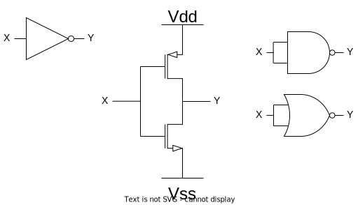
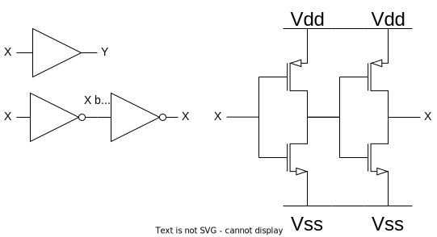
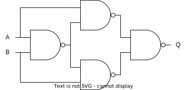
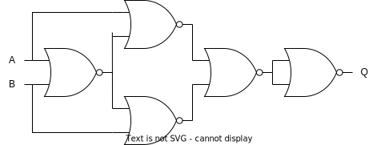
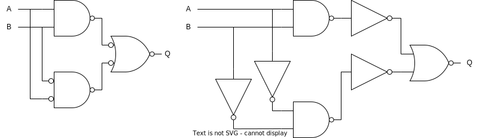
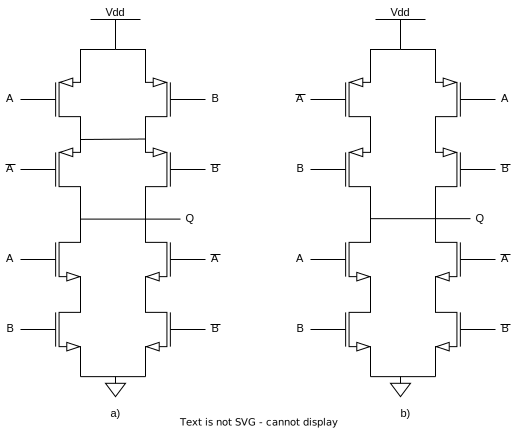
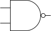
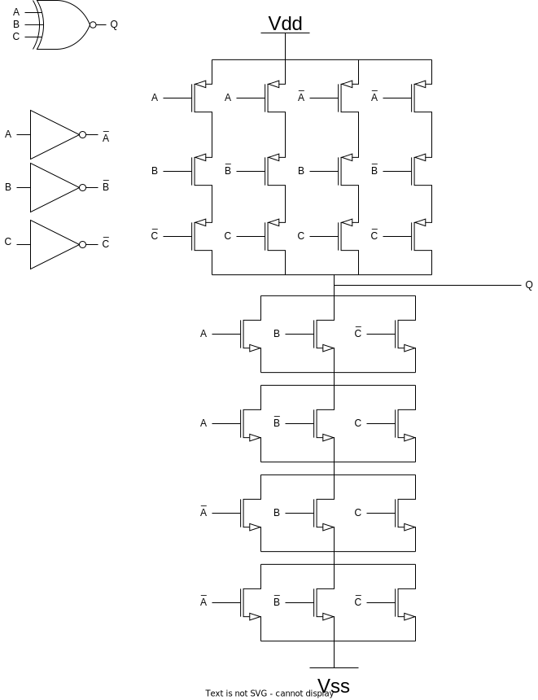

# CMOS Circuits

Some Transistor Gates + Implementation for deepening my knowledge about transistor gates.

## NOT/INV

```math
Q = \overline{A}
```

### Truth Table


| A | Q |
| --- | --- |
| 0 | 1 |
| 1 | 0 |

### Transistor Implementation



> there exist alternative implementations of the NOT gate / Inverter gate but this is the smallest in size(and probably also the fastest), other implementations use NAND or NOR gates that have both gate inputs tied to the same driver, this is because both NAND, NOR or XNOR gates are naturally inverting.

## Buffer

```math
  Q = A
```

### Truth Table


| A | Q |
| --- | --- |
| 0 | 0 |
| 1 | 1 |

### Transistor Implementation



> 2 inverters back to back, in the end Output is equal to the input, regeneration of the signal happens because output is taken straight from the power rails(VDD/VSS) rather then the input

## OR2

```math
Q = A \lor B = A + B
```

### Truth Table


| A | B | Q |
| --- | --- | --- |
| 0 | 0 | 0 |
| 0 | 1 | 1 |
| 1 | 0 | 1 |
| 1 | 1 | 1 |

### Karneugh net


| A\B | 0 | 1 |
| :---: | --- | --- |
|  0  | 0 | 1 |
|  1  | 1 | 1 |

## NOR2

```math
Q = \overline{A \lor B} = \overline{A + B}
```

### Truth Table


| A | B | Q |
| --- | --- | --- |
| 0 | 0 | 1 |
| 0 | 1 | 0 |
| 1 | 0 | 0 |
| 1 | 1 | 0 |

### Karneugh net


| A\B | 0 | 1 |
| :---: | --- | --- |
|  0  | 1 | 0 |
|  1  | 0 | 0 |

## XOR2

```math
  XOR(A,B) = A \oplus B = (A \land \overline{B}) \lor (\overline{A} \land B) = (A \lor B ) \land (\overline{A} \lor \overline{B})
```

> Inverted EQUALITY checker, if inputs are not the same then return True

### Truth Table


| A | B | Q |
| --- | --- | --- |
| 0 | 0 | 0 |
| 0 | 1 | 1 |
| 1 | 0 | 1 |
| 1 | 1 | 0 |

### Karneugh net


| A\B | 0 | 1 |
| :---: | --- | --- |
|  0  | 0 | 1 |
|  1  | 1 | 0 |

- sum of products = $B \cdot \overline{A} + A \cdot \overline{B}$
- product of sums = $A+B \cdot \overline{A} + \overline{B}$

### Transistor Implementation

#### NAND2 only implementation(no inverters)

```math
\overline{\overline{A \cdot (\overline{A \cdot B})} \cdot \overline{B \cdot (\overline{A \cdot B})}}
```

Achieved through:

```math
\displaylines{
XOR(A,B) = (\overline{A} \cdot B) + (\overline{B} \cdot A) = \overline{\overline{(\overline{A} \cdot B)} \cdot \overline{(\overline{B} \cdot A)}}
= \overline{\overline{(\overline{A \cdot B} \cdot B)} \cdot \overline{(\overline{B \cdot A} \cdot A)}} \\

\text{legend: } \\

\overline{A} \cdot B = B \cdot \overline{A} + B \cdot \overline{B} = B \cdot (\overline{B} + \overline{A}) = B \cdot (\overline{B} + \overline{A}) = B \cdot \overline{B \cdot A} \text{ ; } B \cdot \overline{B} = 0 \\

\overline{B} \cdot A = A \cdot \overline{B} + A \cdot \overline{A} = A \cdot (\overline{B} + \overline{A}) = A \cdot (\overline{B} + \overline{A}) = A \cdot \overline{B \cdot A} \text{ ; } A \cdot \overline{A} = 0
}

```



> Size: 16 transistors = 4 x NAND2 = 4 x 4 = 16

#### NOR2 only implementation

```math
\displaylines{
XOR(A,B) = (\overline{A} \cdot B) + (\overline{B} \cdot A) =  \overline{A + \overline{A + B}} + \overline{B + \overline{A + B}} = \overline{\overline{\overline{A + \overline{A + B}} + \overline{B + \overline{A + B}}}} = \overline{\overline{\overline{A + \overline{A + B}} + \overline{B + \overline{A + B}}}} = \overline{(\overline{\overline{A + \overline{A + B}} + \overline{B + \overline{A + B}}}) + (\overline{\overline{A + \overline{A + B}} + \overline{B + \overline{A + B}}})}\\
\text{legend: } \\
\overline{A} \cdot B = \overline{A} \cdot B + A \cdot \overline{A} = \overline{A}(A + B) = \overline{A + \overline{A + B}} \\
A \cdot \overline{B} = A \cdot \overline{B} + B \cdot \overline{B} = \overline{B}(A + B) = \overline{B + \overline{A + B}} \\
\overline{a} = \overline{a + a} \text{ ; } a = a + a
}
```



> Size: 20 transistors = 5 x NOR2 = 5 x 4 = 20

#### NOR + NAND implementation

```math
\displaylines{
XOR(A,B) = (A \lor B ) \land (\overline{A} \lor \overline{B}) = \overline{\overline{A \lor B} \lor \overline{\overline{A} \lor \overline{B}}} = \overline{\overline{\overline{A} \land \overline{B}} \lor \overline{\overline{A \land B}}}
}
```



> size: 20 transistors = 2 x NAND2 + 4 x NOT + 1 x NOR2 = 2 x 4 + 4 x 2 + 1 x 4 = 20

### XOR Transistor Implementation

To generate a XOR we will get:

```math
\displaylines{
\text{Simple implementation (a)}:
\text{} \\
\text{XOR but CMOS logic is inverting this means that logic in the PDN has} \\
\text{to be the inversion of the inversion of the XOR to get a XOR and not XNOR at the output} \\
\text{that means that we have to implement a XNOR logic to the PDN to get a XOR at the output }
\\
XNOR = (A * B) + (\bar{A} * \bar{B}), \text{ when implementing this in the PDN we will get } \bar{XNOR} = XOR \\
PDN = \overline{(A * B) + (\overline{A} * \overline{B})}\\
\text{PUN can be achieved applying De Morgan's Law to the PDN logic equation } \\
PUN = DeMorgan(PDN) = \overline{ \overline{ \overline{(A * B)} * \overline{(\overline{A} * \overline{B})} } } = \overline{(A * B)} * \overline{(\overline{A} * \overline{B})} = (\overline{A} + \overline{B}) * \overline{\overline{A + B}} = (\overline{A} + \overline{B}) * (A + B)
\\ \text{}
\\ \text{Transistor optimal implementation b)}
\\ \text{In this case since XOR logic is double rail logic, inputs and inverted inputs have to be provided}
\\ \text{that means that PUN logic can be written kinda hackypacky}
\\ \text{PUN} = (A \cdot \overline{B}) + (\overline{A} \cdot B)
\\ \text{PDN} = \overline{XOR} = XNOR = (A \cdot B) + (\overline{A} \cdot \overline {B})
\\ \text{Only real requirement is that PUN and PDN logic is not active at the same time}
\\ \text{since PUN drives 1 and PDN drives 0 we can take XOR PUN or PDN not as DEMorgan's computed equivalents but as 2 separate equations}
\\ \text{Option B is better because ??? less Drain capacitance ?? Easier to route?}
}
```



> size: 12 transistors = 1x8 + 2xNOT = 1x8 + 2x2 = 12

Schematic a) is created as if $\text{PDN} = \overline{\overline{XOR}} = \overline{XNOR(A,B)} = (A \cdot B) + (\overline{A} \cdot \overline {B})$ and PUN if we were to create a complementary PUN it would be equal to $\text{PUN} = XOR = (A + B) \cdot (\overline{A} + \overline {B})$. On the other hand b) represents XOR but PUN is taken from usual XOR equation as a sum of products. Logic checks out in b) because all 4 states of input values are covered and are not overlapping.

> Going from a) to b) could be imagined as untwisting a)'s PUN.

## XNOR2

> EQUALITY checker, if inputs are the same return True

### Truth Table


| A | B | Q |
| --- | --- | --- |
| 0 | 0 | 1 |
| 0 | 1 | 0 |
| 1 | 0 | 0 |
| 1 | 1 | 1 |

### Karneugh net


| A\B | 0 | 1 |
| :---: | --- | --- |
|  0  | 1 | 0 |
|  1  | 0 | 1 |

## AND2

```math
AND(A,B) = A \land B = A \cdot B
```

### Truth Table


| A | B | Q |
| --- | --- | --- |
| 0 | 0 | 0 |
| 0 | 1 | 0 |
| 1 | 0 | 0 |
| 1 | 1 | 1 |

## NAND2

```math
NAND2(A,B) = \overline{A \land B} = \overline{A \cdot B}
```

### Truth Table


| A | B | Q |
| --- | --- | --- |
| 0 | 0 | 1 |
| 0 | 1 | 1 |
| 1 | 0 | 1 |
| 1 | 1 | 0 |

### Gate Implementation



### Transistor Implementation

## NAND3

```math
NAND3(A,B,C) = \overline{A \land B \land C} = \overline{A \cdot B \cdot C}
```

### Truth Table


| A | B | C | Q |
| --- | --- | --- | --- |
| 0 | 0 | 0 | 1 |
| 0 | 0 | 1 | 1 |
| 0 | 1 | 0 | 1 |
| 0 | 1 | 1 | 1 |
| 1 | 0 | 0 | 1 |
| 1 | 0 | 1 | 1 |
| 1 | 1 | 0 | 1 |
| 1 | 1 | 1 | 0 |

### Karneugh Net


| AB\C | 0 | 1 |
| :----: | --- | --- |
|  00  | 1 | 1 |
|  01  | 1 | 1 |
|  11  | 1 | 0 |
|  10  | 1 | 1 |

## XOR3

```math
XOR3(A,B,C) = \overline{A}\overline{B}C + A\overline{B}\overline{C} + \overline{A}B\overline{C} + ABC
```

### Truth Table


| A | B | C | Q |
| --- | --- | --- | --- |
| 0 | 0 | 0 | 0 |
| 0 | 0 | 1 | 1 |
| 0 | 1 | 0 | 1 |
| 0 | 1 | 1 | 0 |
| 1 | 0 | 0 | 1 |
| 1 | 0 | 1 | 0 |
| 1 | 1 | 0 | 0 |
| 1 | 1 | 1 | 1 |

### Karneugh Net


| AB\C | 0 | 1 |
| :----: | --- | --- |
|  00  | 0 | 1 |
|  01  | 1 | 0 |
|  11  | 0 | 1 |
|  10  | 1 | 0 |

### Transistor Implementation

```math
\displaylines{
XOR3(A,B,C)= \overline{A}\overline{B}C + A\overline{B}\overline{C} + \overline{A}B\overline{C} + ABC \newline
\text{To make it into a PDN and PUN representation, we need to find the invert of this function to easily implemnent PDN} \\
\text{First: Take your XOR function and double invert it so } Y=\overline{\overline{Y}} \\
\overline{A}\overline{B}C + A\overline{B}\overline{C} + \overline{A}B\overline{C} + ABC = \overline{\overline{\overline{A}\overline{B}C + A\overline{B}\overline{C} + \overline{A}B\overline{C} + ABC}} \\
\text{Second: Take the }\overline{Y}\text{ and apply DeMorgan's Laws to eventually not have groups of inputs inverted together, ex. }\overline{(AB)}\text{ has to be avoided} \\
\overline{\overline{\overline{A}\overline{B}C} \cdot \overline{A\overline{B}\overline{C}} \cdot \overline{\overline{A}B\overline{C}} \cdot \overline{ABC}} = \overline{\overline{\overline{A+B}C} \cdot \overline{\overline{A+C}B} \cdot \overline{\overline{B+C}A} \cdot \overline{\overline{\overline{A}+\overline{B}}C}} = \\ \overline{(A+B+\overline{C}) \cdot (A+\overline{B}+C) \cdot (\overline{A}+B+C) \cdot (\overline{A}+\overline{B} + \overline{C})} \\
\text{Lastly: Having a }\overline{Y}\text{ XOR3 representation we can implement PDN and get PUN}
}
```


